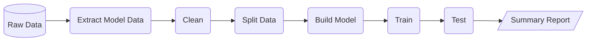
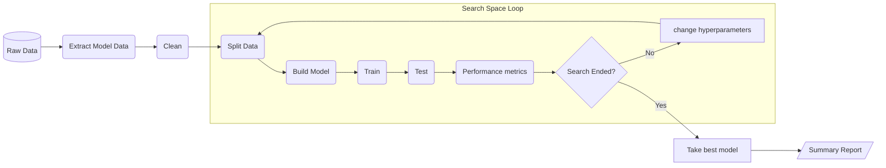

For the documentation of mermaid visit https://mermaid-js.github.io/mermaid#/
# **Machine Learning Pipelines**

## Given hyperparameters

```mermaid
graph LR
    raw[(Raw Data)] --> extract(Extract Model Data)
    extract --> clean(Clean)
    clean --> split(Split Data)
    split --> build(Build Model)
    build --> train(Train)
    train --> test(Test)
    test --> report[/Summary Report/]
```

## Hyperparameter optimization

```mermaid
graph LR
    raw[(Raw Data)] --> extract(Extract Model Data)
    extract --> clean(Clean)
    clean --> split(Split Data)
    split --> build(Build Model)
    build --> train(Train)
    train --> test(Test)
    test --> performance(Performance metrics)
    performance --> loop-ends{Search Ended?}
    loop-ends --> |No| change[change hyperparameters]
    change --> split
    loop-ends --> |Yes| return-best[Take best model]
    return-best --> report[/Summary Report/]

    subgraph loop[Search Space Loop]
        split
        build
        train
        test
        performance
        loop-ends
        change
    end
```