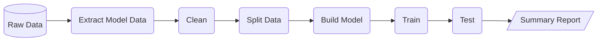
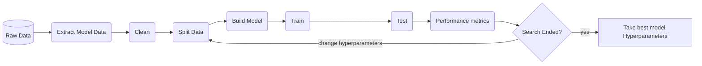

# **Machine Learning Pipelines**

## Given hyperparameters

```mermaid
graph LR
    raw[(Raw Data)] --> extract(Extract Model Data)
    extract --> clean(Clean)
    clean --> split(Split Data)
    split --> build(Build Model)
    build --> train(Train)
    train --> test(Test)
    test --> report[/Summary Report/]
```

## Hyperparameter optimization

```mermaid
graph LR
    raw[(Raw Data)] --> extract(Extract Model Data)
    extract --> clean(Clean)
    clean --> split(Split Data)
    split --> build(Build Model)
    build --> train(Train)
    train --> test(Test)
    test --> performance(Performance metrics)
    performance --> loop-ends{Search Ended?}
    loop-ends --> |yes| return-best[Take best model Hyperparameters]
    loop-ends --> |change hyperparameters| split
```