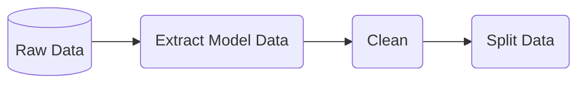

# Pipeline data_processing

## Overview

This pipeline handle the process of data extraction, cleaning, integration

## Pipeline inputs
* Raw data
* Parameters for data extraction and cleaning schemes.

## Pipeline outputs
*  Splitted Data sets namely training and testing.